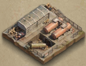

# Zona Restringida

## Indice
* [¿Como funciona el evento?](#como-funciona-el-evento)
* [Edificios](#edificios)
  * [Arsenal](#arsenal)
  * [Torre de Guardia](#torre-de-guardia)
  * [Centro de Comando](#centro-de-comando)
  * [Taller](#taller)
  * [Gasolinera](#gasolinera)
  * [Hospital](#hospital)
  * [Armería](#armeria)
  * [Recolector de Puntos](#recolector-de-puntos)
* [Estrategia del Clan](#estrategia-del-clan)
  * [Antes de entrar](#antes-de-entrar)
  * [Distribución de equipos](#distribución-de-equipos)
  * [Instrucciones Generales](#instrucciones-generales)

## ¿Como funciona el evento?

* Dos clanes luchan por los puntos de victoria.
* Intentan tomar el control de los edificios en el campo de batalla, para recibir puntos de victoria y bufos.
* Si cualquiera de los dos clanes llega a los 50.000.000 de puntos, gana.
* Si ninguno de los dos clanes llega a esa cantidad de puntos antes de que acabe el tiempo, entonces el clan con más puntos de victoria, gana.

## Edificios

### Arsenal

**Edificio central en el mapa**

Al ocupar el Arsenal proporciona Puntos de Victoria (Individual y Clan), más un bono de Puntos de Victoria cada 10 minutos (Clan).

### Torre de Guardia

### Centro de Comando

### Taller

### Gasolinera

### Hospital

### Armeria

### Recolector de Puntos
:warning: *(Pendiente Traducción correcta al español)* :warning:

## Estrategia del Clan

### Antes de entrar

### Distribución de equipos

| Grupo A (**Arsenal**) | Grupo B (**Centro Cmd 1 y 2**) | Grupo T (**Taller 1 y 2**) | Grupo G (**Gasolinera**) | Grupo TS (**Torres**) | Grupo H (**Hospital**) |
|:---------------------:|:------------------------------:|:--------------------------:|:------------------------:|:---------------------:|:----------------------:|
| **Murdock**           | **Leono**                      | **Lilith**                 | **Machete**              | **Boss**              |                        |
| Marks                 | Ike2101                        | Puto                       |                          |                       |                        |
| Dipaz                 | Oscuridad                      | Skautron                   |                          |                       |                        |
| Ruben                 | Son Mohikan                    | Damablanca                 |                          |                       |                        |
| She                   | Sun Jin Woo                    |                            |                          |                       |                        |

### Instrucciones Generales

